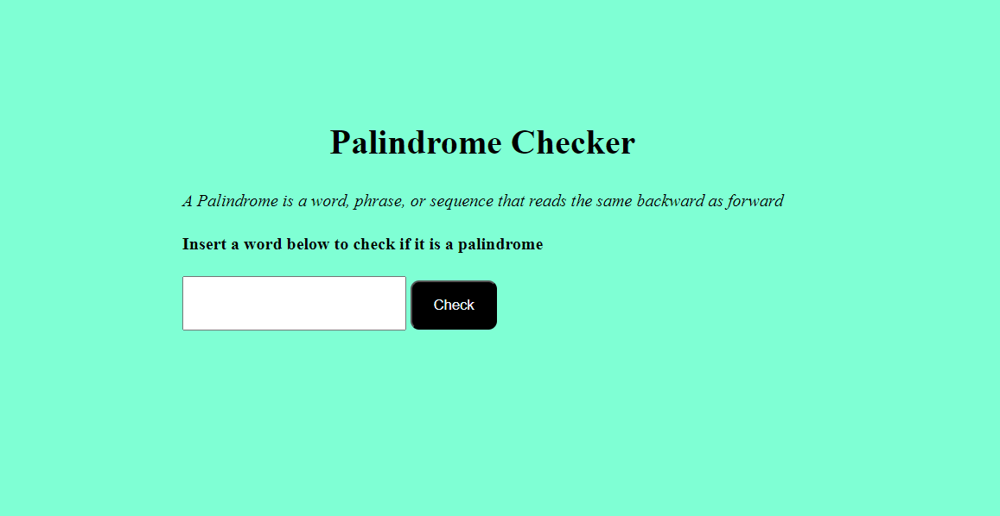

#Palindrome Checker
This repository contains a simple web application that allows the user to input a string to check whether or not it is a palindomre. 

##Technologies
* Javascript
* HTML
* CSS

Here is a screenshot of the webpage:

